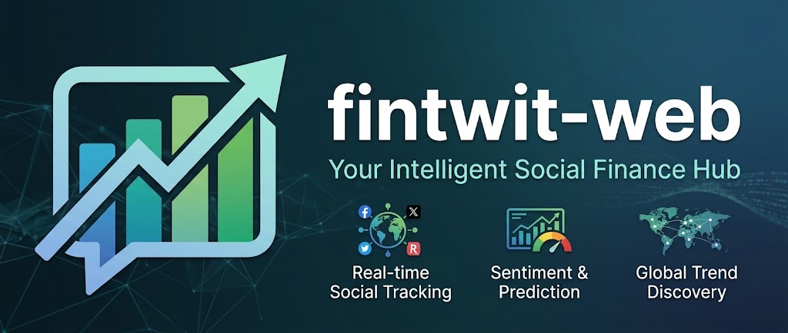
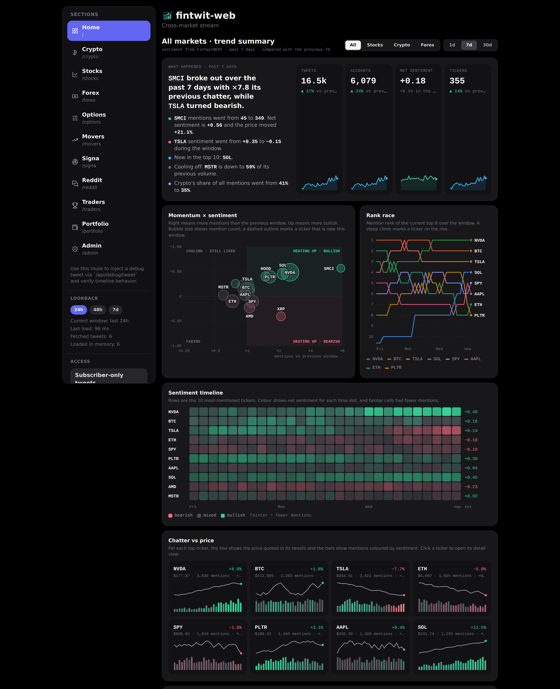
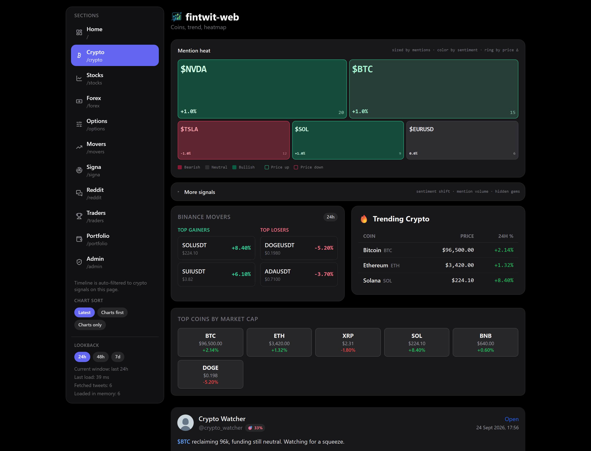
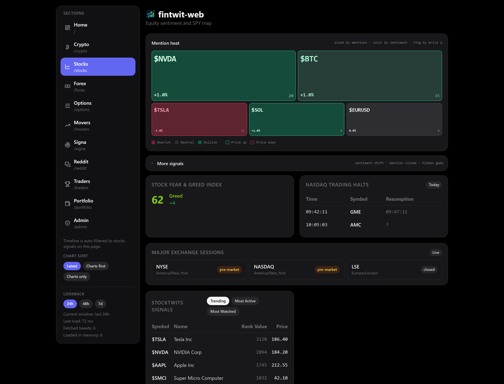
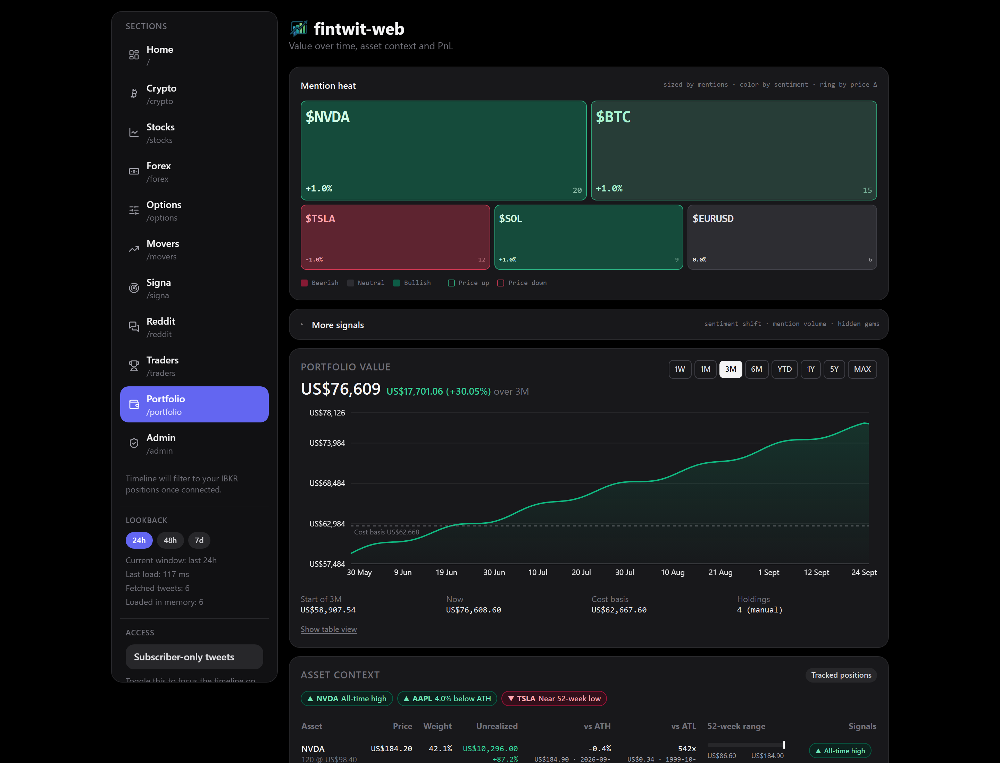
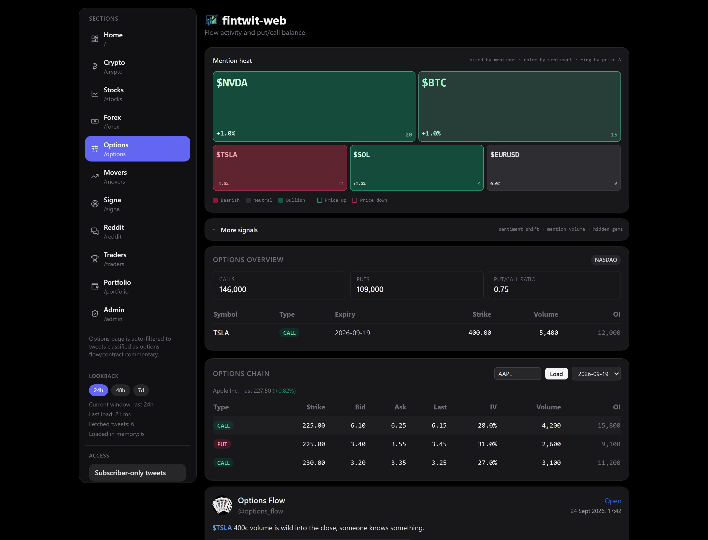

# fintwit-web

**Self-hosted dashboard for crypto, stocks, forex and options — enriched Twitter/X streams,
sentiment analysis, and market signals.**



---

<p align="center">
  
  
  <a href="https://github.com/psf/black"></a>
</p>

`fintwit-web` aggregates financial markets data from Twitter/X, Reddit, Binance, Yahoo Finance,
TradingView, and more — enriched with ML-based sentiment analysis and chart recognition — and
surfaces it through a self-hosted React dashboard.

It's a full-stack migration of the [`fintwit-bot`](https://github.com/StephanAkkerman/fintwit-bot)
Discord bot: same data pipelines and ML models, but without Discord's rate limits, low data
density, and lack of a custom UI. The dashboard covers crypto, stocks, forex, options, NFTs,
enriched tweets, and live portfolio tracking. The migration is ongoing and incremental — see
[Documentation](#documentation) for current coverage.

## Key Features 🔑

- **Enriched tweet timeline** — streamed live from X/Twitter, classified by ticker, scored for
  sentiment (FinTwitBERT), and flagged for chart images (chart-recognizer)
- **Crypto markets** — price index, trending coins, gainers/losers, funding rates, liquidations,
  exchange listings, TradingView ideas
- **Stock markets** — price index, earnings calendar, halts, StockTwits, TradingView ideas,
  gainers/losers
- **Options, forex & NFTs** — options overview/volume/SPACs/short interest, forex index with
  economic events and yield curve, NFT top/trending/upcoming/P2E collections
- **Reddit** — WallStreetBets scraping for cross-subreddit ticker trends
- **Portfolio tracking** — live trade tracking, with optional Interactive Brokers sync
- **Self-hosted** — SQLite or PostgreSQL storage, runs via Docker Compose, no Discord required

### Machine Learning Models 🤖

Multiple custom-trained models power the enrichment pipeline. All are lightweight and load
automatically when the backend starts:

- [FinTwitBERT-sentiment](https://huggingface.co/StephanAkkerman/FinTwitBERT-sentiment) —
  classifies the sentiment of financial tweets
- [FinTwitBERT-wsb-sentiment](https://huggingface.co/StephanAkkerman/FinTwitBERT-wsb-sentiment) —
  classifies the sentiment of WallStreetBets posts
- [chart-recognizer](https://huggingface.co/StephanAkkerman/chart-recognizer) — 
  recognizes if an image is a financial chart
- [chart-info-detector](https://huggingface.co/StephanAkkerman/chart-info-detector) — 
  extracts the ticker and price from a chart image if the post text doesn't contain it
- [stock-recognizer-model](https://huggingface.co/StephanAkkerman/stock-recognizer-model) — 
  recognizes the mentioned stocks in reddit posts

## Screenshots 📸

<p align="center">
  
</p>

The enriched tweet timeline (above) is the flagship view — each tweet is ticker-classified,
sentiment-scored, and matched with a live price card, alongside cross-market overview panels
(mention heat, sentiment shift, sector rotation) built from Twitter, Reddit, and StockTwits data.

<table>
  <tr>
    <td width="50%"><br><sub>Crypto — trending coins, Binance movers, market cap</sub></td>
    <td width="50%"><br><sub>Stocks — fear/greed index, halts, StockTwits signals</sub></td>
  </tr>
  <tr>
    <td width="50%"><br><sub>Portfolio — value over time, asset context, IBKR sync</sub></td>
    <td width="50%"><br><sub>Options — overview, put/call ratio, live options chain</sub></td>
  </tr>
</table>

## Table of Contents 🗂

- [Key Features](#key-features-)
- [Screenshots](#screenshots-)
- [Quick Start Guide](#quick-start-guide-)
- [Manual Setup (Click-Ops)](#manual-setup-click-ops)
- [Deploy with Docker](#deploy-with-docker)
- [Documentation](#documentation)
- [Installation](#installation-)
- [Environment Variables](#environment-variables)
- [Usage](#usage-)
- [Contributing](#contributing-)
- [License](#license-)

## Quick Start Guide 🚀

1. Install backend and frontend dependencies (see [Installation](#installation-)).
2. Copy `.env.example` to `.env` and set `X_AUTH_TOKEN` and `X_CT0` (see
   [X session cookies](#x-session-cookies-for-the-tweet-timeline)). Everything else is optional;
   without these two the dashboard still runs, just without the tweet timeline.
3. Run backend and frontend together from the repo root:

```bash
npm run dev
```

This starts `uvicorn` on `127.0.0.1:7999` and the Vite dev server (which proxies `/api/*` to
it) at the same time. To run them separately instead, see [Start separately](#start-separately).

## Manual Setup (Click-Ops)

A few one-time steps can't be automated by Terraform or Docker — they involve logging into a
third-party dashboard or an interactive login flow. Do these before your first deploy; you
only need the ones for features you actually want to use.

### X session cookies (for the tweet timeline)

The tweet timeline streams your X **Following** feed as your own logged-in session, not through
an official API key. It needs two cookies from that session:

1. Log into [x.com](https://x.com) in your browser.
2. Open DevTools (F12) → **Application** tab (Firefox: **Storage**) → **Cookies** →
   `https://x.com`.
3. Copy the values of `auth_token` and `ct0` into `.env`:

```bash
X_AUTH_TOKEN=...
X_CT0=...
```

These cookies grant full access to your X account: `.env` is gitignored, never commit it, and
treat the values like a password. They stay valid until that browser session is logged out;
when X starts rejecting them, the timeline shows an "X session expired" notice — recapture
both values and restart the backend.

Without them the rest of the dashboard works normally and the timeline explains how to connect.

<details>
<summary>Already have a <code>curl.txt</code>?</summary>

A captured `HomeLatestTimeline` request (DevTools → Network → right-click → Copy as cURL) still
works when `X_AUTH_TOKEN`/`X_CT0` are unset: put it at the repo root for local runs, or at
`state/curl.txt` for Docker. `X_CURL_PATH` overrides the location.

</details>

### Cloudflare account, API token, and domain delegation (for public hosting)

Only needed if you're exposing the dashboard publicly via the Cloudflare Tunnel setup below:

1. Create a free [Cloudflare](https://dash.cloudflare.com/sign-up) account and add your domain.
2. At your domain registrar, switch its nameservers to the ones Cloudflare assigns. This is a registrar-level step; it isn't managed by Terraform.
3. Create an API token at [dash.cloudflare.com/profile/api-tokens](https://dash.cloudflare.com/profile/api-tokens) with:
- Account → Access: Apps and Policies → Edit (not - Read)
- Account → Cloudflare Tunnel → Edit
- Zone → DNS → Edit
- Zone → Zone → Read
4. Optional: Set up Access login gate (see [infra/README.md](infra/README.md)).

### Interactive Brokers login (for portfolio sync)

Only needed if you're enabling `IBKR_ENABLED=true`. IB Gateway runs headless most days, but
still requires occasional interactive login/2FA approval — see
[Optional: Interactive Brokers portfolio sync](#4-optional-interactive-brokers-portfolio-sync)
below for the VNC login flow.

### Reddit app credentials (optional)

Only needed for more reliable `/api/reddit/wsb` access; without it, the service falls back to
an unauthenticated HTTP client. Create an app at
[reddit.com/prefs/apps](https://www.reddit.com/prefs/apps) (type "script") to get a client ID
and secret — see [Optional: Reddit API Credentials](#optional-reddit-api-credentials) below.

## Deploy with Docker (recommended)

Works on a Raspberry Pi, a home server, or any Linux/macOS host. **The stack is
localhost-only by default** — `ibgateway` (IBKR) and `cloudflared` (public tunnel) are Compose
[profiles](https://docs.docker.com/compose/how-tos/profiles/) that sit out unless you opt in,
so plain `docker compose up` never exposes anything beyond `127.0.0.1`, and never requires IBKR
or Cloudflare credentials.

### 1) Install Docker

```bash
curl -fsSL https://get.docker.com | sh
sudo usermod -aG docker $USER
newgrp docker
docker --version
docker compose version
```

### 2) Clone and configure

```bash
git clone https://github.com/StephanAkkerman/fintwit-web.git
cd fintwit-web
cp .env.example .env
```

Fill in `.env` — at minimum `X_AUTH_TOKEN` and `X_CT0` for the tweet timeline (see
[X session cookies](#x-session-cookies-for-the-tweet-timeline)). Keep env formatting as
`KEY=value` (no spaces around `=`) for max compatibility. Every `.env` value is passed to the
backend container.

### 3) Build and run (localhost-only)

```bash
docker compose down # stop any existing containers first to avoid conflicts
docker compose up -d --build
```

This runs just two services, both bound to `127.0.0.1` only:

- Frontend (Nginx + React build) on `127.0.0.1:3000`
- Backend (FastAPI) on `127.0.0.1:7999`

The frontend container proxies `/api/*` and `/api/stream` to the backend container. This is a
complete, working deployment on its own — stop here if you don't need IBKR sync or public
access, and skip straight to [Verify](#verify).

Build speed tips (useful on constrained hardware like a Pi):

- For day-to-day restarts, use `docker compose up -d` (without `--build`).
- Rebuild only when dependencies or Dockerfile change: `docker compose build backend`.
- Keep BuildKit enabled for cached package downloads across rebuilds:

```bash
export DOCKER_BUILDKIT=1
export COMPOSE_DOCKER_CLI_BUILD=1
```

The backend Docker image installs CPU-only PyTorch wheels (`download.pytorch.org/whl/cpu`) to
avoid pulling large CUDA runtime packages on Linux hosts.

#### Backend tuning (PyTorch / chart recognition)

If your backend crashes with a PyTorch `Illegal instruction` error in chart recognition
(common on Raspberry Pi and other ARM/older CPUs), temporarily disable chart inference in
`.env`:

```bash
CHART_ENABLED=false
```

Chart data extraction (OCR of symbol/price off chart screenshots, run only when a chart
tweet's text has no ticker) shares the same PyTorch stack via `ultralytics`. Disable it
independently with:

```bash
CHART_EXTRACTION_ENABLED=false
```

To pin/downgrade PyTorch used by the backend Docker image, set `TORCH_VERSION` in `.env` and
rebuild:

```bash
docker compose up -d --build backend
```

To isolate the exact failing stage (PyTorch conv vs timm vs chart model), run the chart stack
probe inside the backend container:

```bash
docker exec -it fintwit-backend python -m app.runtime.probe_chart_stack
```

This prints the first failing probe and whether it crashed with `SIGILL`.

### 4) Optional: Interactive Brokers portfolio sync

Adds the `ibgateway` container and a backend sync worker. In `.env`, set:

```bash
IBKR_ENABLED=true
TRADING_MODE=live       # or paper
IBKR_PORT=4003           # live=4003, paper=4004
VNC_SERVER_PASSWORD=change-me-to-a-strong-password
TWS_USERID=your-ibkr-username
TWS_PASSWORD=your-ibkr-password
COMPOSE_PROFILES=ibkr    # add ",tunnel" too if combining with step 5
```

Then bring the `ibkr` profile up (either works once `COMPOSE_PROFILES` is set in `.env`):

```bash
docker compose up -d --build
# or, without setting COMPOSE_PROFILES:
docker compose --profile ibkr up -d --build
```

IB Gateway runs headless most days, but may still require occasional interactive login/2FA
approval — see [Manual Setup](#manual-setup-click-ops) above. If you already use RealVNC to
access your host's desktop, keep using it; otherwise, open a local VNC client:

```bash
# install once on the host if needed
sudo apt update
sudo apt install -y remmina remmina-plugin-vnc
```

In Remmina:

- Protocol: VNC
- Server: `127.0.0.1:5901`
- Password: `VNC_SERVER_PASSWORD` from `.env`

Complete IB Gateway login and any 2FA prompt, then keep it running.

Verify sync health:

```bash
docker logs -f fintwit-ibgateway
docker logs -f fintwit-backend

curl -H "X-API-Key: YOUR_API_KEY" http://127.0.0.1:7999/api/ibkr/status
curl -H "X-API-Key: YOUR_API_KEY" "http://127.0.0.1:7999/api/ibkr/trades?limit=20"
```

Expected behavior:

- `ibkr/status` eventually reports `connected: true`
- `ibkr/trades` returns recent executions when available

Notes:

- Backend in Docker connects to host `ibgateway` (container network), not `localhost`.
- For `ghcr.io/gnzsnz/ib-gateway`, backend should use socat ports: live `4003`, paper `4004`.
- The IB Gateway settings are persisted in a Docker named volume (`ibgateway-settings`) to
  avoid host filesystem permission issues on Raspberry Pi.
- If you see `connection refused on ibgateway:4003`, IB Gateway is up but not fully logged
  in/authorized yet, or login/2FA is incomplete.

### 5) Optional: expose it publicly via Cloudflare Tunnel + Access login

Adds the `cloudflared` container. Requires a Cloudflare account, API token, and a domain
delegated to Cloudflare nameservers — see [Manual Setup](#manual-setup-click-ops) above if you
haven't done that yet.

Provision the tunnel, DNS record, and an Access login gate with Terraform, from `infra/`:

```bash
cp terraform.tfvars.example terraform.tfvars
# edit terraform.tfvars with your Cloudflare token/account values and
# access_allowed_emails (only these addresses will be able to log in)

terraform init
terraform plan
terraform apply
terraform output -raw tunnel_token
```

Back in the repo root, set the token and profile in `.env`:

```bash
CLOUDFLARE_TUNNEL_TOKEN=<terraform tunnel_token output>
COMPOSE_PROFILES=tunnel   # add "ibkr," too if combining with step 4
```

Once the tunnel is up, visiting the public hostname shows Cloudflare's hosted login page
first — anyone not on the allowlist is blocked at Cloudflare's edge before the request ever
reaches your Pi. Allowed visitors verify with a one-time code emailed to them; no account or
password to manage. `access_allowed_emails` only seeds the list on the first `terraform
apply` — after that, add or remove people from the **Admin** page in the dashboard itself
(it edits the same Cloudflare policy through the API) rather than editing `terraform.tfvars`.
That needs a few more `.env` values; see [infra/README.md](infra/README.md#admin-page-invites).

```bash
docker compose up -d --build
# or, without setting COMPOSE_PROFILES:
docker compose --profile tunnel up -d --build
```

Public hostname is `<subdomain>.<zone_name>` from `infra/terraform.tfvars` (e.g.
`fintwit.example.com`).

### Verify

- Local-only: `http://127.0.0.1:3000` serves the frontend
- With the `tunnel` profile: your configured hostname (`https://<subdomain>.<zone_name>`)
  serves the frontend too
- API calls and stream work through frontend proxy paths (`/api/*`, `/api/stream`)

### Updating

Once deployed, pull the latest code and rebuild with a single command:

```bash
make update
```

This runs `git pull`, `docker compose down`, then `docker compose up -d --build` — the same
three steps as [Build and run](#3-build-and-run-localhost-only) above, so it also picks up any
`COMPOSE_PROFILES` (e.g. `ibkr`, `tunnel`) set in `.env`. No `make` on your host? Run those
three commands directly instead.

### Start separately
1. Run the backend using:
```bash
uvicorn app.api.main:app --port 7999 --reload
```
2. Run the frontend using:
```bash
cd frontend
npm install
npm run dev
```

### Optional: Reddit API Credentials
The `/api/reddit/wsb` service uses an `asyncpraw` client first (legacy-style)
to avoid Reddit anti-bot blocks, with HTTP fallback when credentials are missing.

Set one of these credential sets in your environment for more reliable Reddit access:

```bash
# Modern names
REDDIT_CLIENT_ID=...
REDDIT_CLIENT_SECRET=...
REDDIT_USER_AGENT=fintwit-web

# Legacy fintwit-bot compatible names
REDDIT_PERSONAL_USE=...
REDDIT_SECRET=...
REDDIT_APP_NAME=fintwit-web

# Optional (only if your Reddit app config needs user auth)
REDDIT_USERNAME=...
REDDIT_PASSWORD=...
```

## Documentation

- [Documentation Index](docs/README.md)
- [Migration Status](docs/migration-status.md)
- [API and Frontend Coverage Matrix](docs/api-frontend-coverage.md)
- [Frontend Integration Map](docs/frontend-integration-map.md)
- [Cloudflare Terraform Notes](infra/README.md)

## Installation ⚙️

```bash
git clone https://github.com/StephanAkkerman/fintwit-web.git
cd fintwit-web

# Backend
pip install -r requirements.txt

# Frontend
cd frontend && npm install && cd ..
```

Then follow the [Quick Start Guide](#quick-start-guide-) above, or
[Deploy with Docker](#deploy-with-docker) to run it self-contained (localhost-only by
default — no IBKR or Cloudflare account needed).

## Environment Variables

All environment variables are documented in [`.env.example`](.env.example) — copy it to `.env`
and fill in what you need. Only `X_AUTH_TOKEN` and `X_CT0` matter for a first run (see
[X session cookies](#x-session-cookies-for-the-tweet-timeline)); everything else is optional and
has a sensible default.

Setting `API_KEY` protects the backend's `/api` with an `X-API-Key` header. The dashboard keeps
working because the frontend's proxy (nginx in Docker, Vite in dev) attaches the key
server-side, so it never reaches the browser.

## Usage ⌨️

Once running, the dashboard is served at `http://127.0.0.1:3000` in dev (`npm run dev`) or at
your configured public hostname when deployed. The backend API lives under `/api/*`, and
`/api/stream` carries the live SSE tweet feed.

## Contributing 🛠

Contributions are welcome! If you have a feature request, bug report, or proposal for code
refactoring, please feel free to open an issue on GitHub. See [CONTRIBUTING.md](CONTRIBUTING.md)
for code style and PR guidelines. We appreciate your help in improving this project.


## License 📜

This project is licensed under the MIT License. See the [LICENSE](LICENSE) file for details.
